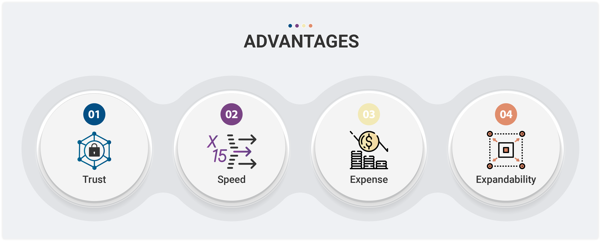

# Advantages

### **신뢰**

&#x20;스마트 컨트랙트를 통해 서비스 이용과 보안 관련하여 치명적인 사고가 발생하고 있습니다. 우리는 Uniswap 을 모티브 하여 가능한 모든 위험을 제거하고 더욱 안전한 서비스를 제공하기 위해 노력합니다. 또한 마지막 거래를 통한 최종 결값만 보여주기 이전에 오라클을 이용하여 이전 거래 내역까지 서비스를 제공으로써 보다 투명한 서비스를 제공하고 고객들의 신뢰를 얻으려 하고 있습니다. 오라클 가드를 통해 예기치 못한 가격 변동을 제어 합니다. 메인넷 운영하는 기관들과 빠른 협의를 통해 적극적으로 대응합니다.

### **속도**

&#x20;Ethereum 블록 생성주기는 약 15초이지만 AERGO 블록 생성주기는 약 1초입니다. 이는 거래를 이용하는 데 사용되는 시간이 최소 15배 빠르게 응답을 제공받을 수 있다는 이야기입니다. AERGO 메인넷의 TPS 또한 10,000TPS 이상 가능합니다. 이는 한국정보통신기술협회(TTA) 의 GS 인증을 통해 검증 되었습니다! 1,000,000TPS까지 도달한 AERGO Blockchain으로 반으로 쾌적한 서비스를 제공받을 수 있습니다. 즉시 실행되는 빠른 응답속도를 느껴보세요.

### **비용**

&#x20;같은 DeFi 서비스를 이용하더라도 값비싼 Ethereum의 문제로 한 번의 주문에 많은 수수료가 나가고 있습니다. 현재 높은 이자 수익 실현을 이루고도 이 수수료 문제로 수익률이 저하되거나 마이너스가 되는 경우도 발생을 하고 있습니다. AERGO Blockchain을 통해 이 문제를 해결하여 수수료 문제를 최소화하였습니다.

### **확장성**

&#x20;AERGO Blockchain에서 서비스를 제공하지만 AERGO, PlusFi 뿐만 아니라 브릿지 시스템을 통해 BTC, ETH 등 다양한 자산을 제공할 예정입니다. 이외에도 앞으로 다양한 디지털 자산을 추가할 예정이니 기대해 주세요.
