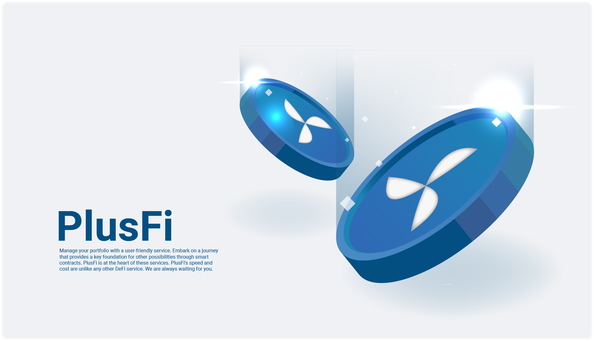

# Intro

### PlusFi는 AERGO Blockchain에서 On Chain으로 동작하는 스마트 컨트랙트 프로젝트입니다. 여러 기능을 제공하는 PlusFi를 통해 여러분의 포트폴리오를 관리하세요.&#x20;

&#x20;PlusFi는 Staking과 Swap 기능을 제공합니다. 아르고 체인에서 진행될 Lending, Leverage Investments, Leverage Farming, IDO에 필수적인 역할을 제공할 것입니다.&#x20;

&#x20;AERGO Blockchain에서 매달 P2E, Medical, Content 등 여러 분야에서 Original의 IDO를 진행하고, PlusFi와 함께 거래되는 모습을 상상해 보세요. 이러한 IDO 는 자연스럽게 중앙화된 거래소, 다른 블록체인까지 영역을 연결, 확장하는 블록체인 시스템이 되게 할 것입니다. 탈중앙화된 시스템을 제공하지만, 사용자 친화적인 서비스도 함께 제공하여, 각 정부의 규제에도 친화적인 접근 방법 또한 제공될 예정입니다.

&#x20;AERGO Blockchain에는 ARC1, ARC2를 통한 토큰 이코노미와 NFT, 스테이블 자산을 위한 모든 기술과 도구들이 준비되어 있습니다. 빠른 속도, 저렴한 수수료, 안정적인 운영, 이 모든 것들이 AERGO Blockchain에서 우리가 DeFi 프로젝트를 시작하지 않을 어떠한 이유도 없습니다.&#x20;

&#x20;PlusFi가 스마트 컨트랙를 통해 다른 가능성들을 위한 핵심적인 기반을 제공하며, 모두를 위한 여정을 시작하려 합니다. 이 시작에는 Trade, Lending, Leverage, IDO, P2E, Various industry data trading 등 여러 서비스들이 기다릴 것 입니다. 이러한 서비스의 중심에는 PlusFi가 있을 것 입니다.

### 우리가 사용하는 AMM(Automated Market Maker) 프로토콜은 탈중화 금융(DeFi) 시장을 일반 대중에게 가져온 결정적인 DEX 프로토콜입니다.

&#x20;설명하자면 AMM은 Trader가 자산을 구매 혹은 판매하고자 할 시, 수학적 공식에 의해 자산의 가격을 자동적으로 결정 시키는 알고리즘입니다. AMM은 오더북이 아닌, 유동성 풀을 기반으로 합니다. 유동성 풀은 빠른 자산 교환을 위해 자산들을 예치 시켜 놓은 스마트 컨트랙트입니다. Trader는 Trader 혹은 마켓메이커와 거래하는 것이 아닌, 유동성 풀을 기반으로 AMM과 거래를 합니다. AMM의 가장 큰 장점은 거래 주문이 얼마나 크든, 유동성 풀이 얼마나 작든 간에 항상 유동성을 제공한다는 것입니다. (즉시 거래 체결 가능)

&#x20;이 AMM 프로토콜을 이용하여 우리는 고객들에게 쉽고 투명한 서비스를 제공하려 합니다.

&#x20;현재 여러 DeFi 서비스의 문제점인 높은 가스 비용과 입, 출금 처리 시간이 오래 걸리는 단점을 보완하고자 이더리움 메인넷이 아닌 아르고 메인넷에서 서비스를 제공합니다.

&#x20;다양한 브릿지 서비스를 이용하여 PlusFi, AERGO만 아니라 ETH, USDT, WBTC 등의 서비스를 아르고 메인넷에서 제공으세요. 속도, 비용 등 다른 DeFi 서비스와 차원이 다른 서비스를 제공으실 수 있습니다.

&#x20;PlusFi는 항상 여러분을 기다리고 있습니다.\
&#x20;이곳에서 여러분이 원하는 만족스러운 서비스를 받으세요.
