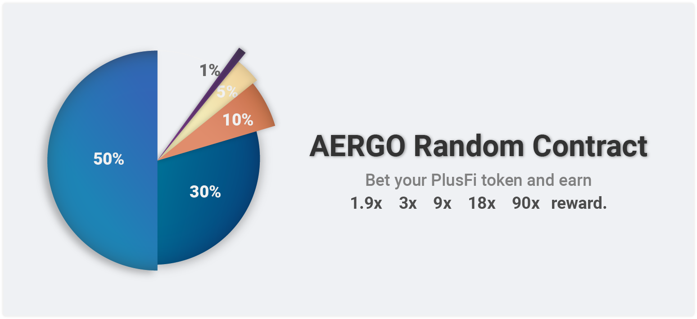

# Game

PlusFi의 가치를 높여줄 재미있는 게임을 즐겨 보세요!

### **AERGO random contract**

50%, 30%, 10%, 5%, 1%의 확률 게임

1.9배, 3배, 9배, 18배, 90배의 보상

원하는 확률에 PlusFi를 예상하여 당첨, 꽝 두 가지 결과를 받아 볼 수 있습니다.

* 당첨이 되면 예상한 토큰의 보상 비율에 맞춰 보상이 이루어지게 됩니다.
* 꽝일 경우 예상한 금액은 누적이 되어 당첨된 사용자의 보상으로 사용이 됩니다.

해당 실행은 AERGO Blockchain에서 random contract를 통해서 이루어집니다. AERGO contract의 훌륭함을 즐겨보세요!

### 토큰 가격 맞추기

UTC +0시 기준으로 하루 한 번 PlusFi에서 제공하는 Swap 서비스의 해당 토큰 가격이 정해 놓은 가격보다 높은지 낮은지에 대한 예측 게임

가격을 맞추지 못한 예상 금액에서 맞힘 예상 비율만큼 보상이 이루어집니다.

참여 수수료는 일부 소각되어 토큰의 가치를 지지하게 됩니다.
